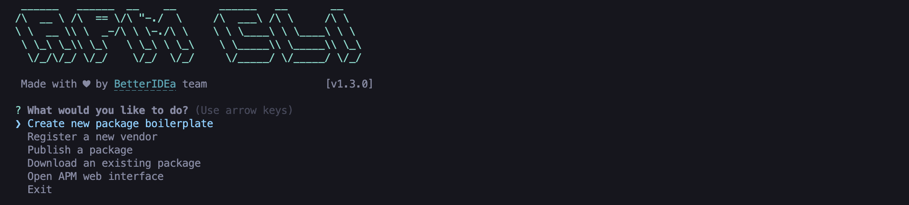

# APM CLI TOOL


[](https://www.npmjs.com/package/apm-tool)
[](https://twitter.com/betteridea_dev)

The `apm-tool` is a command line interface for ao package manager to:
- Initialise new package boilerplate
- Register a new vendor name
- Register/Update packages
- Download a package locally

## Installation

```shell
npm i -g apm-tool
```

## Usage

```shell
apm <command> [arguments]
# or
npx apm-tool <command> [arguments]
```

## Commands

- `init` - Create a new package boilerplate
- `register-vendor` - Register a new vendor name or package
- `publish` - Publish a new package
- `update` - Update an existing package
- `download` - Download a package locally
- `bundle` - Bundle a package (creates a dist folder that can be uploaded to apm web)

## Interactive Menu

```shell
apm
# or
npx apm-tool
```

This will display an interactive menu with all the different commands that can be used.





### `init`

```shell
apm init
```

Similar to `npm init` this will create a new package boilerplate. It will ask for the following information:
- Vendor name
- Package name
- version
- description
- keywords
- license
- repository

An apm.json file will be created containing all the details of the package to be published

### `register-vendor`

```shell
apm register-vendor
```

Registers a new vendor name for packages to be published in.

### `publish`

```shell
apm publish
```

Reads the apm.json file for package details and publishes the package to the apm registry.


### `download`

```shell
apm download <@vendor/package@version>
```

this will download the package locally in the `apm_modules` directory.

### `bundle`

```shell
apm bundle
```

this will bundle your soruce code and create a dist folder that can be uploaded to apm web.